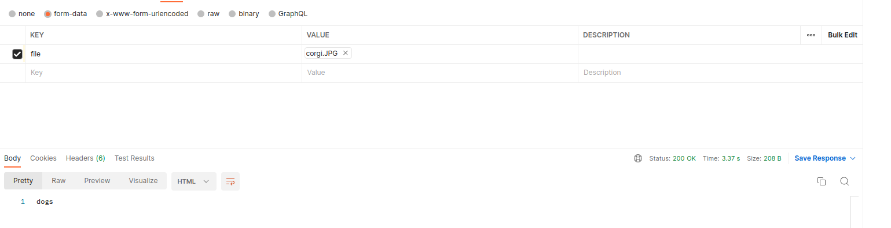

# resnet
## Image classification using Resnet
### Run app
- Exporting the FLASK_APP environment variable
    ```bash
    export FLASK_APP=app.py
    ```
- Run app
    ```bash
    flask run
    ```
### API tests with Postman
- Image 

- Result

